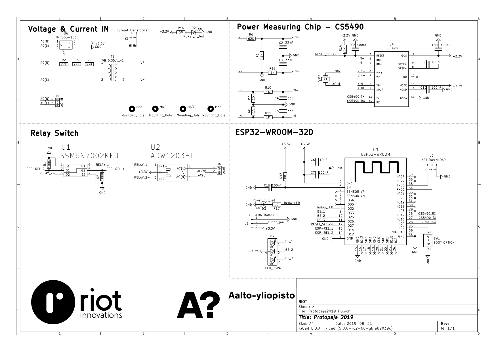
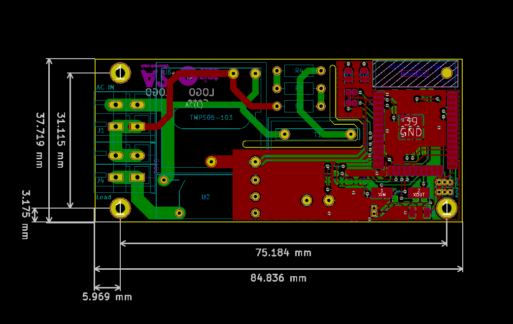
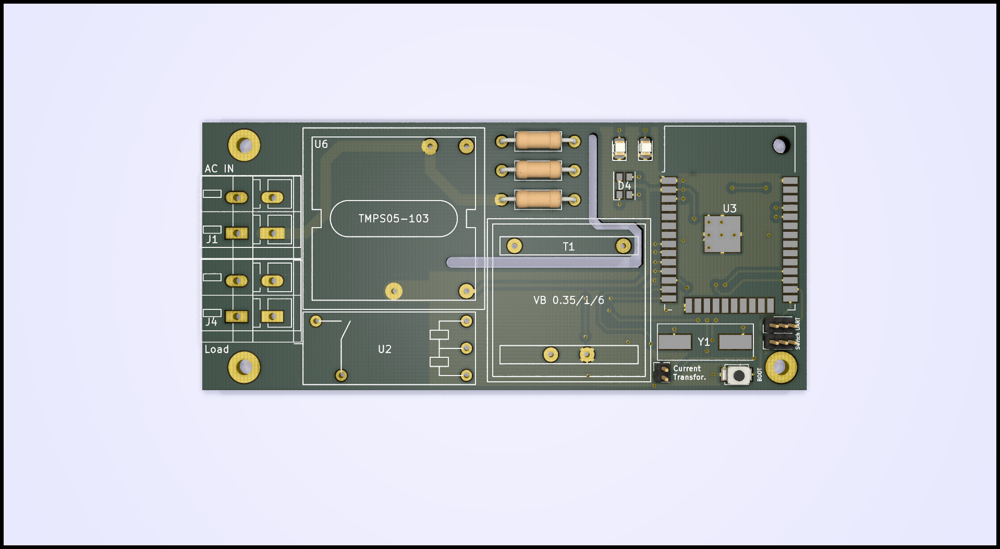

## Piirin suunnittelu

### Sähkökytkentäkaavio

### PCB layouts

### Komponenttilista

| Item | Part | Component | Qty | Cost/unit | Pricing (1000pcs) |
| ------ | ------ | ------ | ------ | ------ | ------ |
| 1 | MCU WLAN | ESP32-WROOM-32D | 1 | 3,42 | 3,42 |
| 2 | Energy measuring circuit | CS-5490 | 1 | 3,35 | 1,67 |
| 3 | Current Transformer | T60404-E4622-X501 | 1 | 10,93 | 5,01 |
| 4 | Relay | ADW1203HLW | 1 | 5,24 | 3,07 |
| 5 | AC/DC power | TMPS 05-103 | 1 | 16,38 | 12,94 |
| 6 | Isolated Transformer | VB 0.35/1/6 | 1 | 5,98 | 4,33 |
| 7 | Chrystal | ABLS2-4.096MHZ-D4Y-T | 1 | 0,50 | 0,19 |
| 8 | LED Green | KPT-2012LCGCK | 1 | 0,0161 | 0,0565 |
| 9 | LED Red | KPT-2012SRC-PRV | 1 | 0,0308 | 0,0612 |
| 10 | Wire-To-Board Terminal Block| 	235-402/331-000 | 2 | 0,036 | 0,30 |
| 11 | or | 250-502 | 2 | 0,037 | 0,332 |
| Total |  |  |  | **45,82** | **31,23** |

** Resistors, capacitors and leds are used 0805 case. You can find components here: 
[KiCad/Components_list.png](./images/Components_list.png)

## Linsensi
Tämä teos on lisensoitu Creative Commons Nimeä 4.0 Kansainvälinen -lisenssillä. Tarkastele lisenssiä osoitteessa http://creativecommons.org/licenses/by/4.0/ tai lähetä kirje osoitteeseen Creative Commons, PO Box 1866, Mountain View, CA 94042, USA.