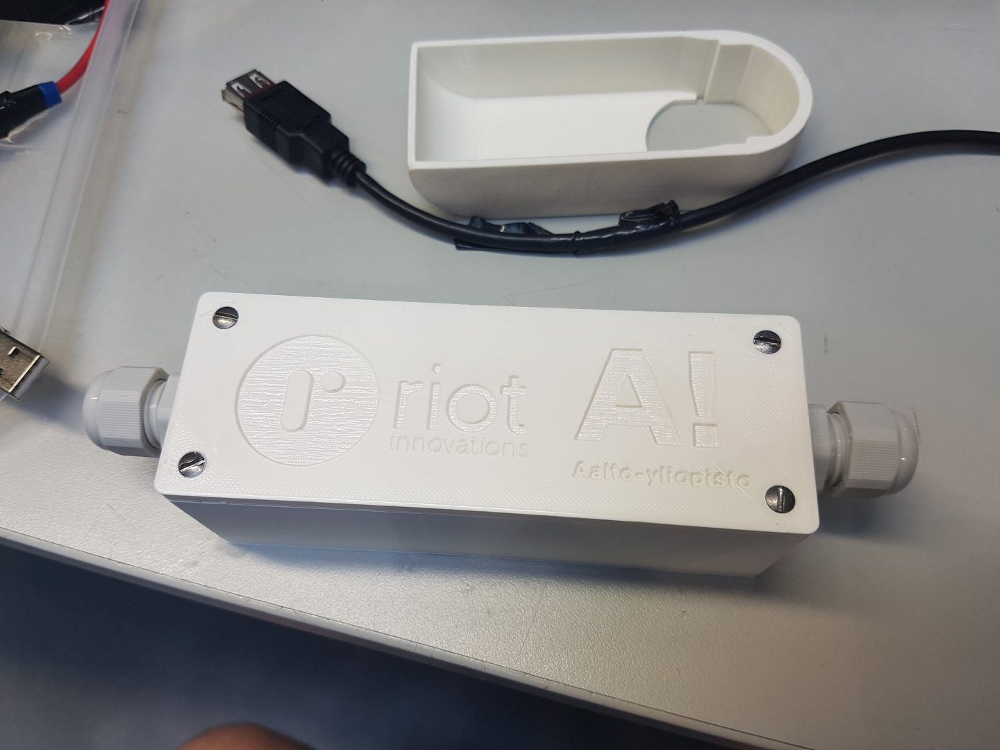
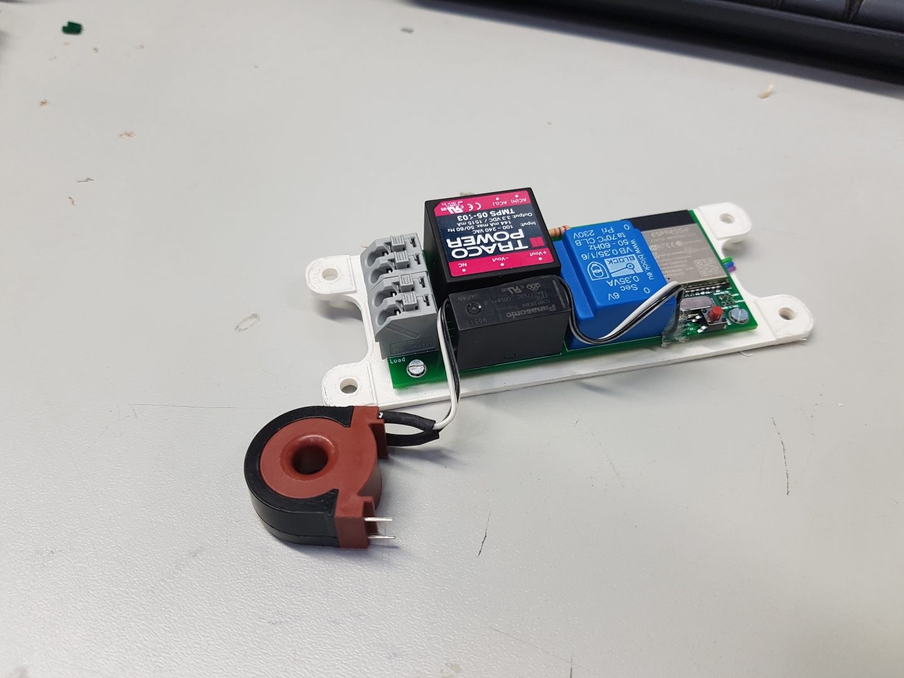
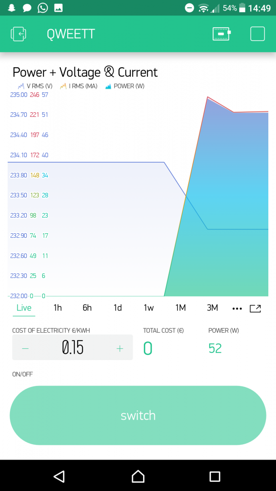

# Etäohjattava virranohjausmoduuli (Protopaja 2019)

**Tämä projekti on osa Aalto-yliopiston [Protopaja](https://protopaja.aalto.fi/) kurssia (kesäkuusta elokuuhun 2019).*

## 1. Johdanto
Yhtiö tarvitsee älykkään järjestelmän ohjaamaan eri sähkölaitteita. Ideana on rakentaa laite, joka
tulisi kiinni pistorasiasta lähtevään johtoon tai mahdollisesti voitaisiin jo suunnitteluvaiheessa
integroida sähkölaiteen rungon sisälle. Laitteella pystyy käynnistämään ja sulkemaan siihen
linkitetyt sähkölaitteet. Tämän lisäksi laite mittaa sähkönkulutusta. Ohjaamiseen yhtiö on
ehdottanut Blynk nimistä ohjelmistoa, jolla etäohjaus tapahtuu wifi:n, bluetoothin tai esim. suoraan
USB:n kautta. 

## 2. Tavoite
Järjestelmän avulla pystyy tarkkailemaan siihen linkitetyn sähkölaitteen energiankulutusta, ja
ohjaamaan laitteen käynnistämistä tai sulkemista etänä tämän datan pohjalta järjestelmään kuuluvan
sovelluksen avulla.
Järjestelmä on ensisijaisesti suunnattu kotitalouksille, ja näin ollen sen loppukäyttäjiä ovat
kuluttajat. Demonstraatiossa otamme sovelluksesta WiFin kautta yhteyden pistorasiaan
asennettavaan laitteeseen, ja käynnistämme ja sammutamme järjestelmän kautta lampun. 

## 3. Tulokset 
Lopputuloksena meillä on tomiva virranmittauspiiri, joka lähettää Blynk-sovellukselle
reaaliaikaisesti dataa sähkönkulutuksesta. Lisäksi Blynk-sovelluksella voidaan laittaa sähkövirta
laitteeseen päälle ja pois. 

Kuva 1: Virranmittauspiiri ulkoa.

Kuva 2: Virranmittauspiiri sisältä. 

### 3.1 Tekninen toiminta
Moduulissa on energianmittauspiiri CS-5490, mikä mittaa virran ja jännitteen, ja lähettää siitä tiedon ESP32-mikrokontrollerille. Blynk-sovellus lähettää mikrokontrollerille tiedon sähkön hinnasta. ESP32 laskee energian kulutuksen, tehon ja sähkölaskun suuruuden ja välittää informaation Blynk-sovellukselle.

Käyttäjä näkee Blynk-sovelluksesta kätevästi tilanteen. Lisäksi käyttäjä voi käskeä katkaisemaan sähkövirran sovelluksesta. Sovellus lähettää tällöin tiedon ESP32:lle, mikä katkaisee virran kulun piirin lävitse. Käyttäjä voi myös avata virran uudelleen sovelluksen kautta.

Blynk ja ESP32 kommunkoivat WiFi:n välityksellä. Sähkövirtaa ohjataan releellä.

### 3.2 Blynk-mobiilisovellusalusta
Blynk on mobiilisovellusalusta joka auttaa kommunikoimaan IoT-laitteiden kanssa (Internet of Things, esineiden internet). Se on yhteensopiva hyvin moneen mikrokontrolleriin ja se tarjoaa kehittämistä varten kattavan kirjaston. Käytimme Blynkkiä virranohjausmoduulin ohjaussovelluksen tekemiseen.

Kuva 3: Kuvakaapaus Blynk-mobiilisovelluksen käyttäjän rajapinnasta. Sovellus sekä näyttää energiankulutuksen, että siitä voi laittaa laitteen sähkövirran päälle tai pois.

## 4. Piirin suunnittelu

**Lisätietoja elektroniikkapiiristä löytyy täältä [KiCad/..](./KiCad/)**

## 5. Ohjelmointi

**Lisätietoja ESP32 lähtökoodistä löytyy täältä [src/..](./src/)**

## 6. Fyysinen kotelo

**Lisätietoa fyysisestä kotelosta löytyy täältä [Autodesk Fusion 360/..](./Autodesk%20Fusion%20360/)**

## Linsensi
Tämä teos on lisensoitu Creative Commons Nimeä 4.0 Kansainvälinen -lisenssillä. Tarkastele lisenssiä osoitteessa http://creativecommons.org/licenses/by/4.0/ tai lähetä kirje osoitteeseen Creative Commons, PO Box 1866, Mountain View, CA 94042, USA.